# My_Portfolio
<h1>purpose</h1>
The purpose of this website is to show case my abilites to future employers. It demonstates my ability to use html and css effectivly to make an inutuitve and responsive website, the information provided on the website itself tells employers about who I am including my education, previous jobs, certifications and the skills that I have. This website is made of 5 pages which are: the home page, about me page, the skills page, the links page, and the contact page. The home page contain profile picture of me and an introduction to who I am, what passions and hobies are. The about me page contains the information of my education, previous jobs, certifications and a link to my resume. The skills page is where i have displayed the various coding languages that i have learnt and some that i will learn soon if you click on the icons it will take you to my git hub repostories which show examples my work in with the language clicked on. The links page is where employers can find the links to my git hub and my linkedin, also linked here are my social media accounts. Finaly the contact page is where employers will find the various methods to contact me such a email, phone and social media.

<h1>Site Map</h1>
website starts on the home page it is expected that viewer just go through the links one buy but the order dosent matter to much. The general flow though is:
  <ol>
  <li>homepage</li>
  <li>aboutme</li>
  <li>skills</li>
  <li>links</li>
  <li>contact</li>
 </ol>

 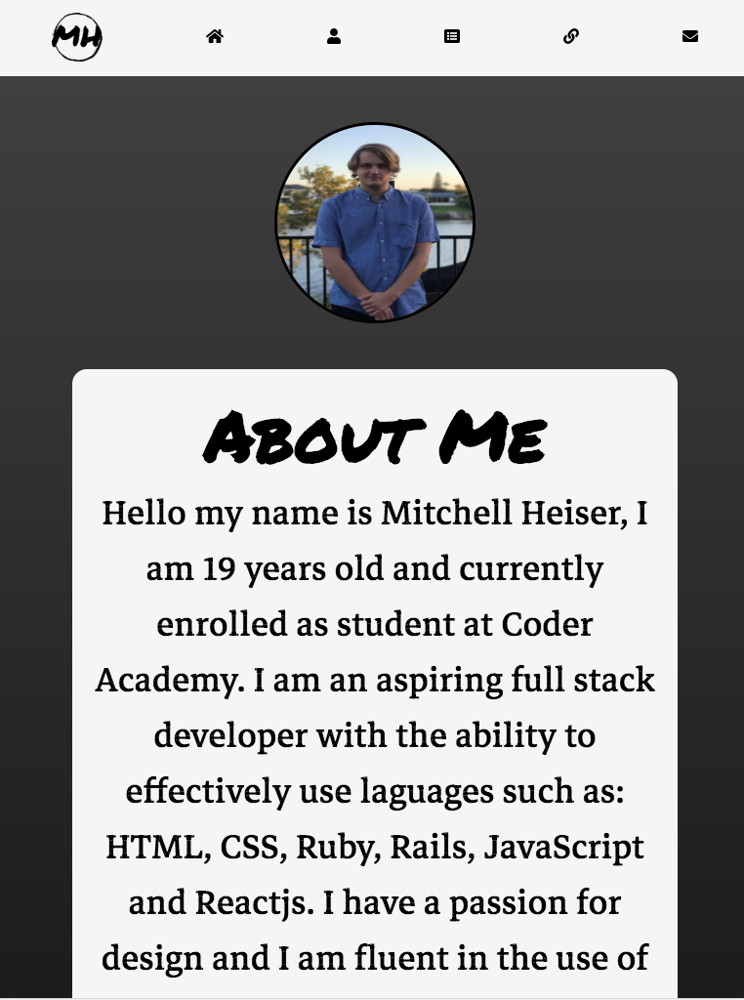
 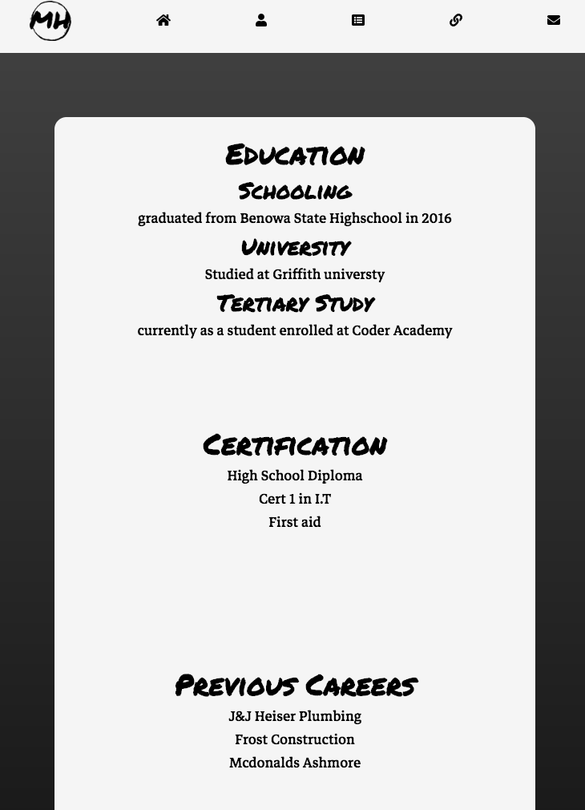
 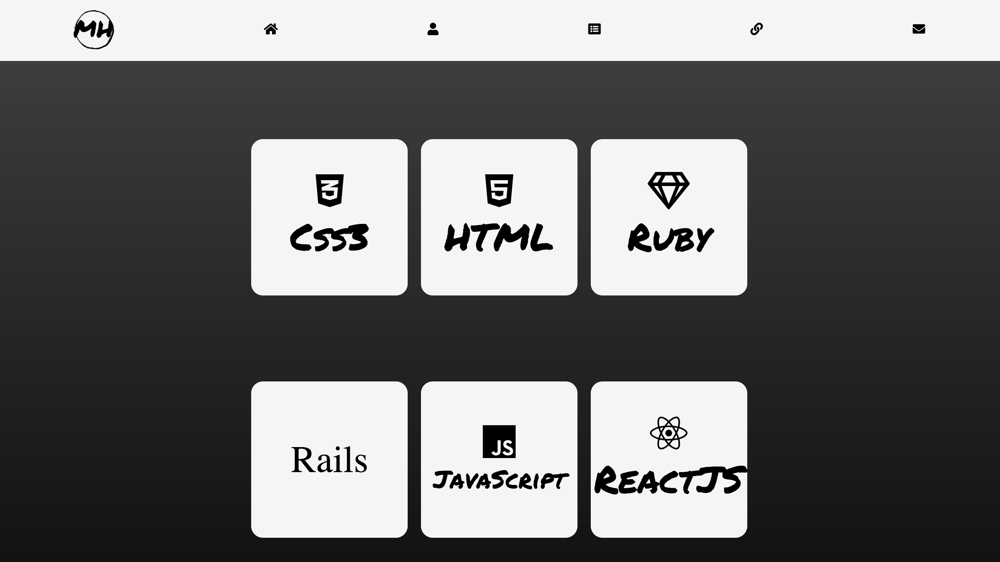
 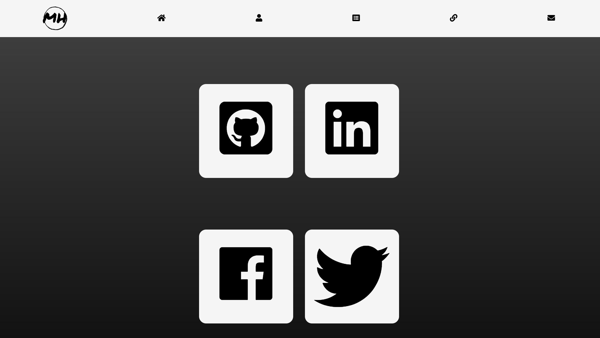
 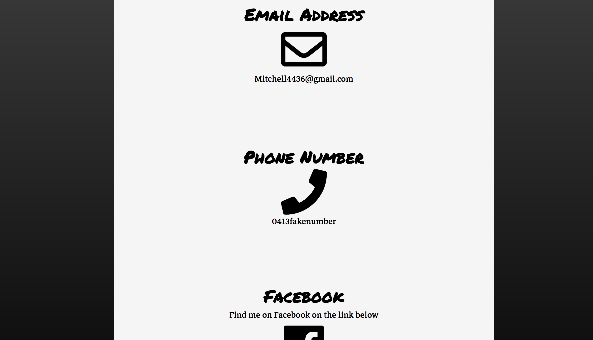

<h1>Tech Stack</h1>
The various software, coding laguages and hosting services that i used to build this site include:

HTML5
css3
photoshop
fontface
googlefonts
git hub
trello

<h1>Design Documentation</h1>

<h3> Design Proccess</h3>
1. create logo
2. create mood boards to decided on overall design of the website
3. chose some fonts and icons
4. create more mood boards mixing in new elements gathered to decide on a final design scheme
5. make wireframes to decide on final layout

<h4>Mood Boards</h4>
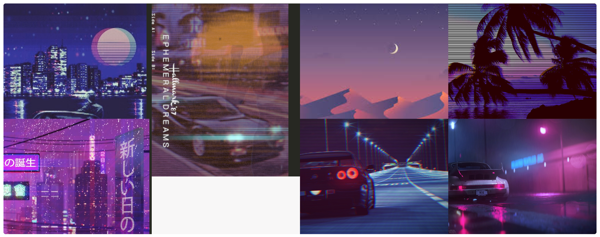
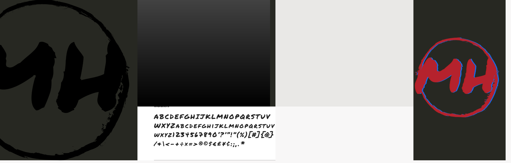

<h3>Wireframes</h3>
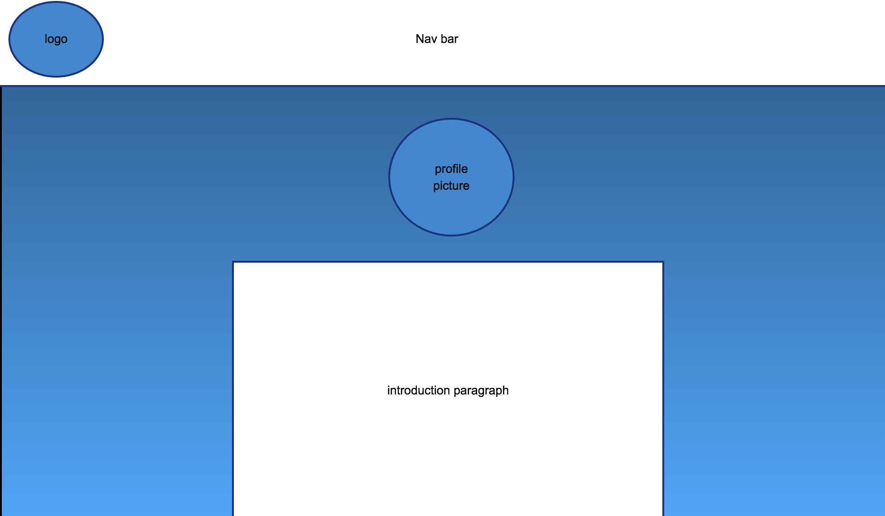
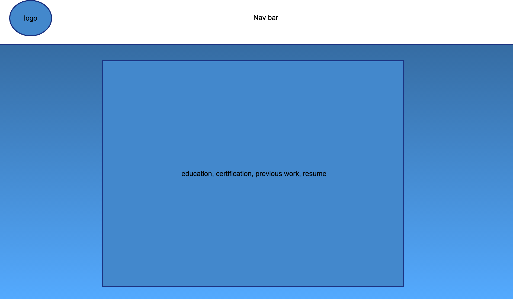
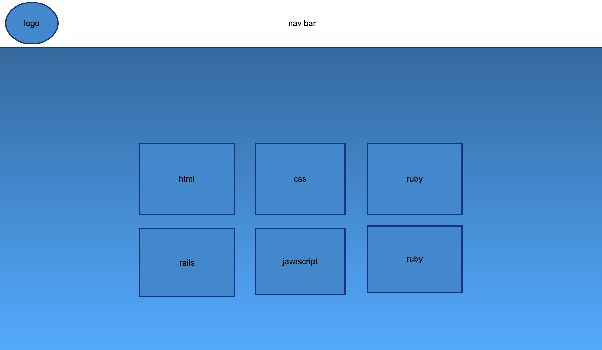
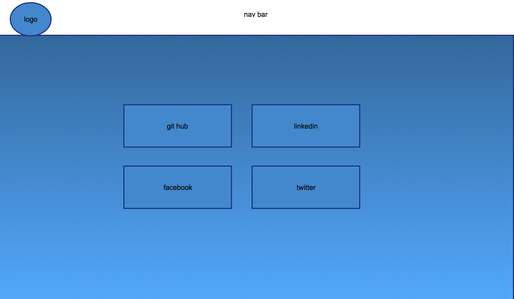
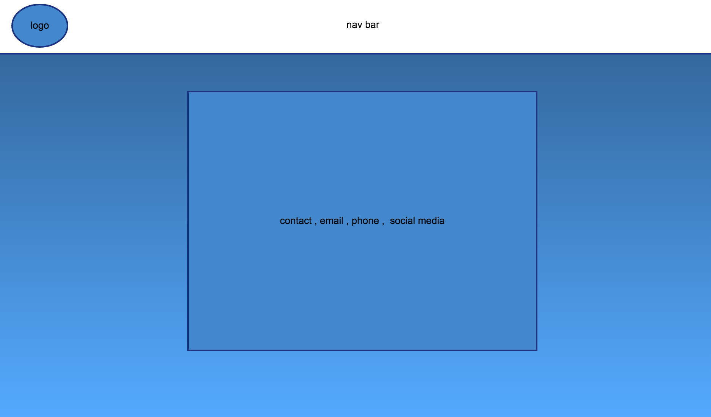
<h3>personal logo</h3>

<h3>Usabilty</h3>

<h1>Details of Planning proccess</h1>

<h3>Trello</h3>
<a href="https://trello.com/b/3JhM2Z3o/portfolio" target="_blank">TrelloBoard</a>
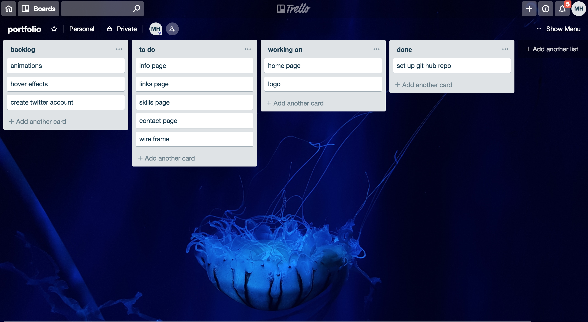
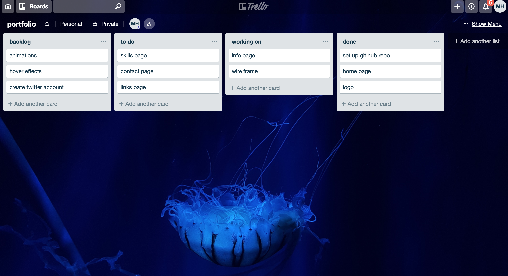
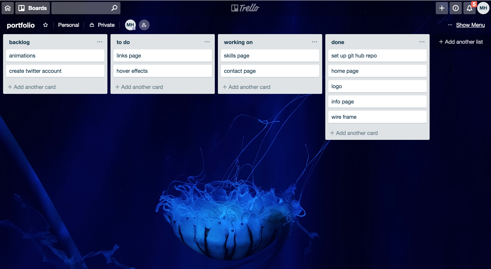
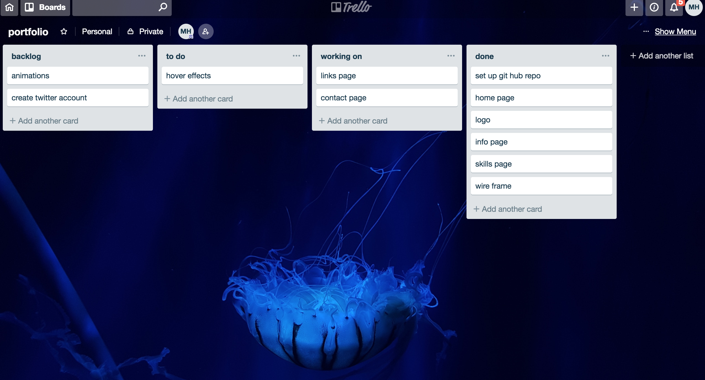
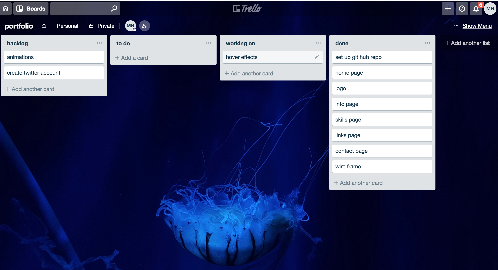
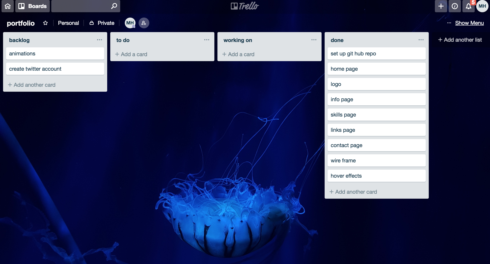

<h1>Short Answer Q&A - Include short answers to the following questions</h1>
<h1>Describe key events in the development of the internet from the 1980s to today</h1>

Since the initial development of the ARPANET in 1961 the internet revolutionized the modern world. Despite that the internet was first created in 1961 it didn’t become available to the public until the late 1980s. Even after the internet first launched commercially it wasn’t really that popular with the general public however this all began to change in 1990 when a man known as Berners-Lee developed the first web browser which he named the WorldWideWeb. In 1991 the WorldWideWeb went live to the world, this is what shaped the internet into what it is today Berners-Lee’s creation changed the world.  The many years following the internet continued to undergo many changes companies such as google ushered in the new era as the lead web browser, from there came the many social media sites that made connecting with people all over the world simple and quick now days almost every household has an internet connection.

<h1>Define and describes the relationship between fundamental aspects of the internet such as: domains, web servers, DNS, and web browsers</h1>

 
Domains are names used to identify one or more IP address. However because the internet is based on IP’s, domain name systems or dns where created to identify the domains and there assigned IP addresses. Web servers are computers that store and deliver webpages, all webservers require a dns in order to identify the IP addresses of the websites they host so that users all over world can connect and view the content of the webpages. Finally web browsers are the software the users use to as the name suggest browse the web, they locate, retrieve and display the content of the internet this includes webpages, images and videos.

<h1>Reflect on one aspect of the development of internet technologies and how it has contributed to the world today</h1>

 
Wireless connectivity is something that I think is taken for granted all too often these days. If you think about it really wasn’t that long ago that if you wanted to connect to the internet you had to do it over a Lan cable, now days we have the ability to connect the internet where ever we want nearly every house has wireless router and now there is even public connections set up across cities so that the public can connect to the internet from wherever.  Wireless connectivity has greatly influenced our lives so much so that we have become entirely dependent, we use it to entertain ourselves, connect with others, run businesses even a lot of the necessary functions that keep our cities habitable are dependent on the wireless network. Wireless connectivity has greatly shaped molded modern society into what it is today and without it I am sure the society we live in would be very different.

